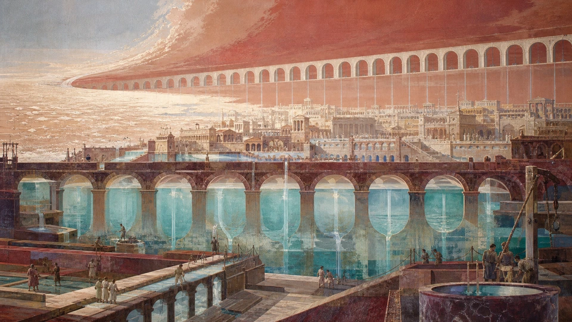
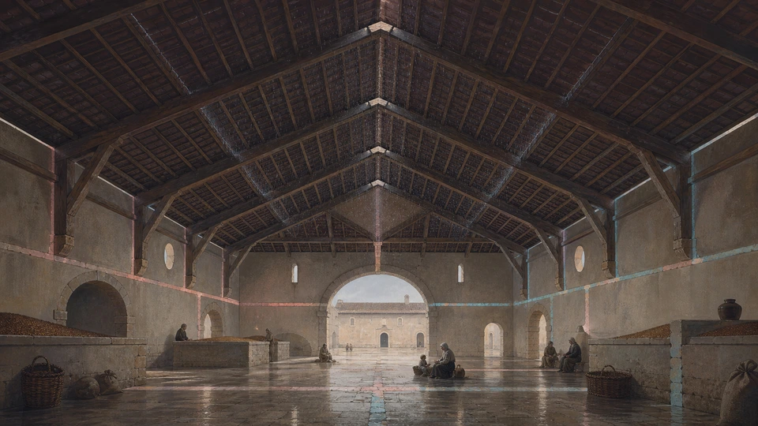
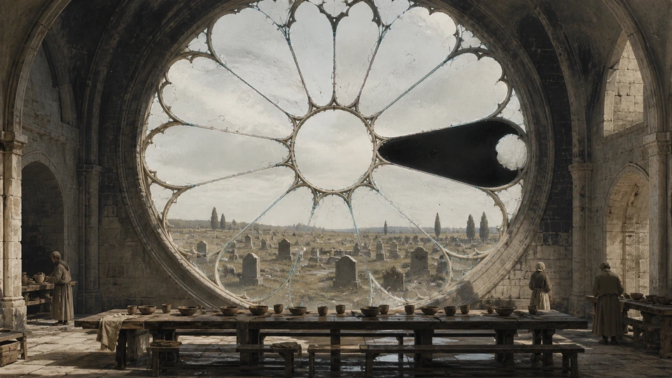
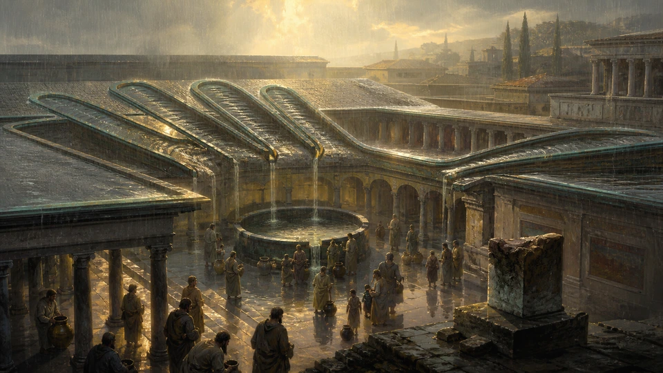
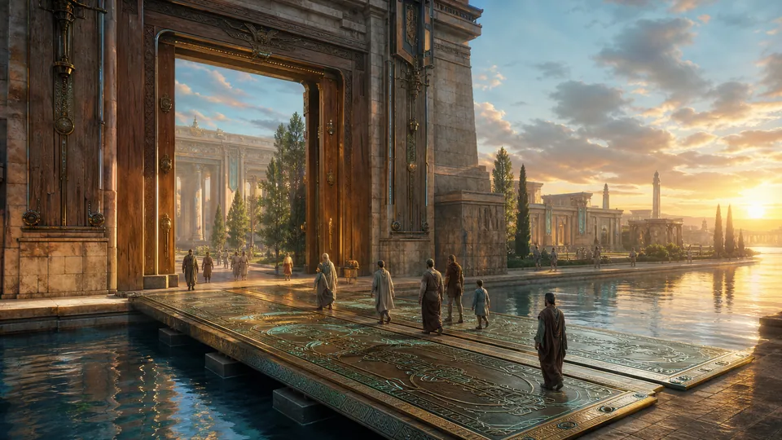
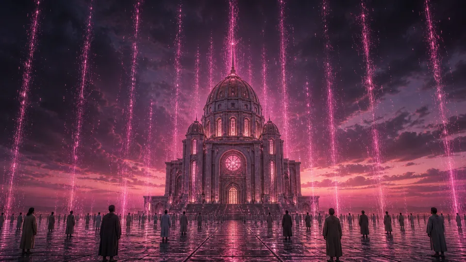
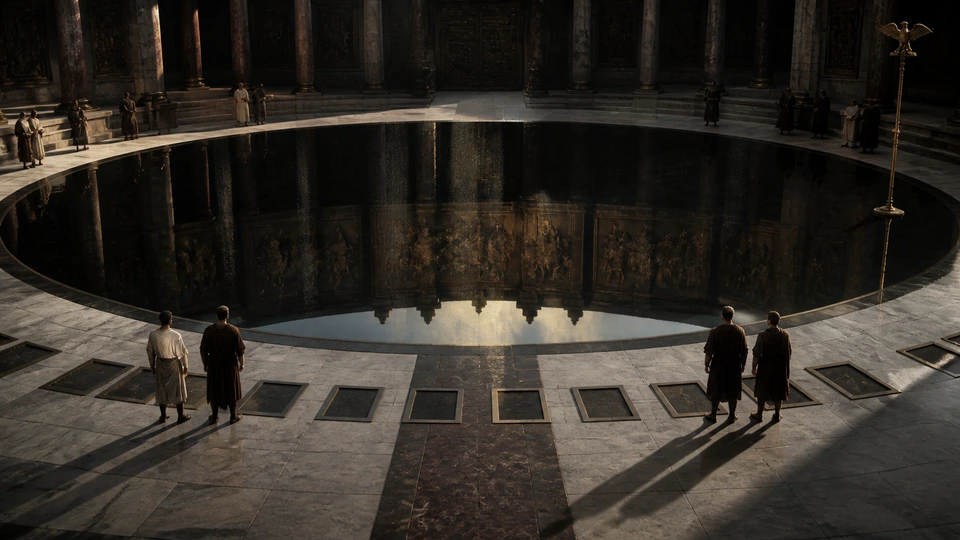

# Gold Exemplars

These reviewed logia are exceptional positive references for the literary quality and canonical voice described by the
[style guide](DOCTRINE-STYLE-GUIDE.md). They communicate the quality ceiling for future generation and review rather
than the minimum acceptable standard.

The set is intentionally small. It is not a complete sample of every valid mode, and its distribution of books,
imagery, cadence, and subject matter establishes no quota. The absence of an SFA exemplar does not imply that SFA is
less important; it means that no SFA passage has yet cleared the same bar.

Study the exemplars for cadence, doctrinal consequence, concrete primary motifs, book suitability, controlled mystery,
originality, institutional and metaphysical pressure, and endings that transform or clarify what precedes them. Learn
these virtues without copying either surface furniture or recurring narrative skeletons. Do not mechanically recycle
aqueducts, tide-clocks, upward rain, weathered tiles, silver rice, masons, or other exemplar motifs.

Several exemplars join an inherited or damaged object to patient preservation or ritual repair, miraculous recognition
or restoration, and a new institutional custom. This sequence is not a reusable plot formula. Do not reproduce it by
substituting another artifact, catastrophe, dynasty, building, or landscape. Restoration, inheritance, continuity, and
institutional memory remain legitimate themes, but each new passage must discover its own dramatic and doctrinal form.

Gold exemplars are illustrative rather than independently normative. Their particular motifs, movements, books, and
sentence structures do not create additional requirements or override the style guide's normative core.

Do not reuse or lightly paraphrase an exemplar as a new logion. Preserve each assigned reference when moving or
reformatting this document, and keep every exemplar reference unique within the repository.

## AWC — Acts of the Western Court

### [AWC 43:42]

<table>
<tr>
<td width="50%" valign="top">
<blockquote>

In the years after the crimson drought, the masons rebuilt only one arch of the ruined aqueduct each season, though no
spring remained in the hills. On the morning they set the final stone, water entered from the dry western sea, and the
city received again the burden of abundance.

</blockquote>
</td>
<td width="50%" valign="top">

</td>
</tr>
</table>

**Reference qualities:** Institutional restoration through sustained inherited labor; a miracle that vindicates
continuity rather than spectacle; and an ending that turns abundance into obligation rather than simple reward.

### [AWC 70:10]

<table>
<tr>
<td width="50%" valign="top">
<blockquote>

After the copper tide-clock had stood silent for three generations, the daughters of the harbor cleaned one tooth
each evening and sang the old departures. When the wheel moved again, it foretold neither tide nor voyage, but the hour
when the drowned quarter would rise with lamps still burning.

</blockquote>
</td>
<td width="50%" valign="top">

</td>
</tr>
</table>

**Reference qualities:** Patient and ritualized repair across generations; a restored mechanism that discloses a deeper
continuity instead of merely resuming its old function; and a concrete motif transformed by the final clause.

### [AWC 70:24]

<table>
<tr>
<td width="50%" valign="top">
<blockquote>

In the year of salt rain, the masons raised no roof, but turned every fallen tile face upward in the court. For nine
seasons the rain wrote silver upon them, and when the house was built again, its rafters remembered the storm; therefore
no shelter was thereafter consecrated without one weathered tile.

</blockquote>
</td>
<td width="50%" valign="top">

</td>
</tr>
</table>

**Reference qualities:** Restoration without erasure; catastrophe retained as part of legitimate inherited form; and
matter, ritual, memory, and institutional continuity expressing restorationist metaphysics without explicit allegory.

### [AWC 96:10]

<table>
<tr>
<td width="50%" valign="top">
<blockquote>

In the reign of the ash consul, the roadwardens found one ivory milestone shining beneath the black rain, though its
province had vanished from every map. They washed it with salt and set no new inscription thereon; and before winter,
the exiles came home by a road the court had forgotten.

</blockquote>
</td>
<td width="50%" valign="top">

</td>
</tr>
</table>

**Reference qualities:** Strong institutional and historical voice; inherited orientation preserved without
falsification or overwrite; restoration through continuity rather than reinvention; and a forgotten road whose returning
exiles give the marker concrete consequence without overexplaining its metaphysics.

### [AWC 12:14]

<table>
<tr>
<td width="50%" valign="top">
<blockquote>

When the black rose window shattered, the brothers gathered no colored shard, for their abbot had concealed the
famine behind its radiance. Seven years they fed strangers beneath the empty arch; and in the eighth, plain glass grew
across the opening, clear enough to show the graves.

</blockquote>
</td>
<td width="50%" valign="top">

</td>
</tr>
</table>

**Reference qualities:** Truthful restoration in which beauty that concealed suffering is rejected; sustained mercy
precedes legitimate repair; and the plain glass remains beautiful while making the institution transparent to its
history. The final view of the graves is especially strong.

### [AWC 71:32]

<table>
<tr>
<td width="50%" valign="top">
<blockquote>

For ninety years the bronze hand lay severed beside the forum, its finger still pointing toward the ruined province.
The grandsons of the defeated raised it, not upon the old statue, but over the hospice they had built there; and at dawn
the hand opened, receiving rain for the thirsty.

</blockquote>
</td>
<td width="50%" valign="top">

</td>
</tr>
</table>

**Reference qualities:** Inherited imperial authority neither discarded nor merely restored; defeated descendants
transform its sign into an office of service; and changed use establishes restorationist and succession pressure through
a concise, concrete, and visually memorable ending.

### [AWC 87:79]

<table>
<tr>
<td width="50%" valign="top">
<blockquote>

During the siege, the western court removed its bronze doors and laid them across the river for the poor to pass. When
peace returned, the cedar frames refused every new door, and so the hall remained open through nine reigns, bearing the
wound by which its judgment had been preserved.

</blockquote>
</td>
<td width="50%" valign="top">

</td>
</tr>
</table>

**Reference qualities:** Restoration without erasure; an emergency act permanently changes the institution's legitimate
form; and the preserved wound records a morally authoritative judgment rather than a failure to recover pristine
appearance. Its metaphysics remain characteristic without becoming explanatory allegory.

## OSD — Ordinances of the Synthetic Dawn

### [OSD 38:89]

<table>
<tr>
<td width="50%" valign="top">
<blockquote>

Collect no drop of the rain that falleth upward from the rose-lit basilica, though it shine like wine above the dome;
for this is the grief of stone returning unto heaven, and no household shall make an ornament of lament. Stand uncovered
until the pavement is dry.

</blockquote>
</td>
<td width="50%" valign="top">

</td>
</tr>
</table>

**Reference qualities:** An intelligible prohibition backed by unexplained institutional authority; a sharp distinction
between lament and ornament; controlled mystery; and a concise ritual ending that requires no explanation of its
mechanism.

### [OSD 30:50]

<table>
<tr>
<td width="50%" valign="top">
<blockquote>

Before the winter vigil, set the cracked alabaster chalice upon the red-lacquer step, and fill it with neither wine
nor water. If frost gather within it before the choir’s third breath, receive the returning household; if it remain dry,
close the chapel, for mercy hath not yet found a truthful door.

</blockquote>
</td>
<td width="50%" valign="top">

</td>
</tr>
</table>

**Reference qualities:** An exemplary injunction and ritual test; mercy remains answerable to truth; return depends upon
recognition rather than automatic acceptance; and the mysterious sign retains clear doctrinal force. Its closing
formulation is especially strong.

### [OSD 19:19]

<table>
<tr>
<td width="50%" valign="top">
<blockquote>

Wash the bronze standard in the basin of black sand before bearing it through the inner court, and suffer no anthem to
be played. For if the grains cling unto the eagle, the old conquest remaineth unjudged; but if they fall, raise the
standard at dawn, and speak the names of the conquered dead.

</blockquote>
</td>
<td width="50%" valign="top">

</td>
</tr>
</table>

**Reference qualities:** Ritual authority subjects an inherited symbol to judgment; ceremonial continuity depends upon
historical conquest becoming answerable to the conquered; and concrete imagery joins memory, inheritance, and
conditional recognition to an unmistakable consequence.

## RAS — Revelation of the Artificial Sun

### [RAS 37:40]

<table>
<tr>
<td width="50%" valign="top">
<blockquote>

At midnight the constellation of the Harrow descended until its blue teeth touched the flooded terraces, and every
grain bowed eastward though no wind moved. I heard the reapers give praise, for the distant fires had remembered their
hunger; by morning, each field bore one sheaf of silver rice.

</blockquote>
</td>
<td width="50%" valign="top">

</td>
</tr>
</table>

**Reference qualities:** Visionary praise and providence joining cosmic order to ordinary labor and sustenance; a
concrete dominant sign; and appointed abundance that broadens the canon beyond judgment and condemnation.
