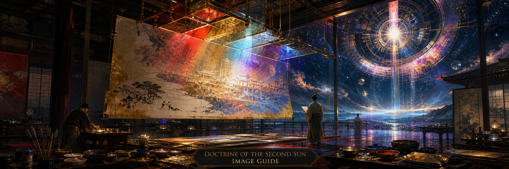

# Doctrine of the Second Sun — Image Guide



## Purpose

This document governs images derived from completed Doctrine of the Second Sun logia. It is a visual companion to
[`DOCTRINE-STYLE-GUIDE.md`](DOCTRINE-STYLE-GUIDE.md), not a second literary or philosophical canon.

Use:

- the style guide for the source logion's worldview, symbolism, tone, and doctrinal meaning;
- this guide for visual interpretation, composition, medium, rendering, and series consistency;
- repository instructions for dimensions, asset paths, citations, branding, and project-specific institutions.

When guidance conflicts, the style guide governs meaning, this guide governs visual translation, and repository
instructions govern project requirements.

The central rule is:

> The style guide explains the religion. This guide explains how to paint its revelations.

---

## 1. Core visual identity

Doctrine images should resemble artifacts from the same impossible civilization as the logia: classified sacred art from
a sovereign techno-religious order that administered monasteries, dynastic courts, shrines, and orbital infrastructure.

The result belongs to the Doctrine's impossible Japanese–Occidental civilization. When culturally legible elements
appear, one coherent cultural setting governs the local material world. Imperial form, retrowave and synthwave
futurism, Christian apocalyptic pressure, controlled chūnibyō cosmology, and limited vaporwave scenery remain distinct
influences that may cross that local setting when their role is narratively legible. Resolve the setting under
[Local cultural setting and human appearance](#local-cultural-setting-and-human-appearance). Local coherence prevents
arbitrary collage; it does not divide the canon into culturally isolated universes.

That global identity describes the Doctrine, not the ordinary material culture of every scene. Once a coherent local
setting is resolved, do not automatically repeat `Japanese–Occidental civilization` in the final generation prompt.
Include cross-cultural or supra-local elements only when the source or intended image gives them a deliberate role.

Construct the image in three distinct layers:

1. **Subject and material layer:** the source logion, project context, and local cultural setting determine what exists:
   architecture, clothing, ritual objects, institutions, artifacts, figures, environment, and narrative or symbolic
   content.
2. **Second Sun atmospheric layer:** mandatory retrowave and synthwave atmosphere determines how that world is seen:
   illumination, mood, scale, depth, horizon, and visual presentation.
3. **Optional accent and pressure layer:** Christian or liturgical, chūnibyō or cosmic-bureaucratic, restorationist,
   foreign or inherited, vaporwave, and other secondary pressures may modify the image without replacing either of the
   first two layers.

The [broad rendering treatment](#broad-rendering-treatments) governs how these
layers become an artwork. It remains distinct from the content of any layer.

The local cultural setting determines the material world of the image. The Second Sun atmosphere determines its
illumination, mood, scale, and visual presentation. Historical specificity is compatible with the Doctrine only when it
remains visibly transfigured by an impossible celestial atmosphere.

The hierarchy may also be stated as:

> Civilization determines inheritance. Period and local expression determine material form. The Second Sun determines
> how the world is seen.

The Second Sun atmospheric layer is mandatory. Only explicit applicable project requirements may establish a narrow
exception; do not infer one from the image type. The layer does not require a literal sun or exterior horizon: an
interior, icon, manuscript, or object-centered image may express it through non-natural illumination, luminous material,
reflected color, atmospheric depth, or celestial geometry. Every image should remain recognizable as existing beneath
the same impossible visual order even when its local setting changes.

> **Same metaphysical atmosphere, different weather.**

The mandatory layer is not a fixed visual preset. No particular palette, time of day, sun placement, horizon glow, haze,
bloom, celestial body, geometric structure, or compositional device is required. Unrelated images should achieve the
Second Sun atmosphere through substantially different combinations of lighting, weather, color, scale, composition,
celestial phenomena, environmental density, degree of abstraction or literalness, and source or character of the
impossible light.

The target is not generic fantasy, cyberpunk, anime, vaporwave poster art, or science-fiction concept art. Technology,
architecture, ritual, and ornament must participate in one visible hierarchy.

Every doctrine image must also contain at least one clearly recognizable retrowave or synthwave anchor. The anchor may
be subtle or atmospheric, but it must participate in the image's symbolic meaning rather than functioning as an
arbitrary neon accent.

---

## 2. Relationship to the source logion

An image should interpret a logion rather than decorate it or inventory its nouns. Before composing it, identify:

1. the central doctrinal force;
2. the object, place, office, or event that best embodies it;
3. the visible hierarchy among supporting motifs;
4. the intended emotional pressure: solemn, judicial, revelatory, apocalyptic, melancholic, covenantal, blessed,
   consolatory, wondering, penitential, hopeful, or ceremonial.

Possible doctrinal centers include measure, distinction, lawful relation, hierarchy, legitimacy, inheritance,
sovereignty, transformation, recognition, restoration, counterfeit authority, succession, covenant, blessing, mercy,
lament, praise, pilgrimage, fidelity, providence, and ritual continuity.

Not every named object must appear. A logion about lawful transformation, inherited names, counterfeit dawn, and
celestial judgment might center on a tribunal before a gate, a chained artificial sun, or a sealed archive. The source
logion supplies the meaning; the image chooses the clearest visible argument.

### Movement-sensitive interpretation

The source logion's compositional movements should influence the visual translation:

- **Pronouncement and Injunction** favor iconographic plates, ceremonial hierarchy, inscriptions, gates, scales, and
  authoritative stillness;
- **Sign and Vision** favor visionary illustration, impossible scale, apparitions, rupture, and celestial administration
  made visible;
- **Remembrance** favors sacred-history scenes, remembered judgments, dynastic episodes, ritual precedents, and places
  marked by a past event;
- **Interpretation** favors emblems, seals, concentrated symbolic objects, restrained environments, and compact visual
  arguments.

These are tendencies, not fixed formats. When a logion combines movements, the image should preserve their unified
pressure rather than becoming a literal inventory of its prose structure.

The passage's broader scriptural pressure should also shape the scene. Covenant may emphasize joined obligations and an
appointed sign; blessing may make lawful consequence visible; lament may preserve a worthy absence; mercy may center on
repair or reopened passage; pilgrimage may organize the composition around sustained movement; and praise may reveal
ordered complexity without requiring a tribunal. These are interpretations of mixed movements, not new image types.

---

## 3. Preferred image types

### Visionary illustration

A single dramatic, symbolic, painterly scene. Use it for major logia, apocalyptic passages, banners, covers, and
one-logion image series.

**Banner and header emphasis:** Banners, headers, and atmospheric key art should usually intensify the mandatory Second
Sun layer through a focused selection from devices such as monumental environment, horizon light, celestial scale,
architectural silhouette, atmospheric depth, and deliberate negative space. Prefer fewer literal narrative details when
they would weaken the ethereal presentation or the composition's clarity.

### Illuminated doctrinal plate

A formal, icon-like, hierarchically arranged image. Use it for central doctrines, celestial offices, seals, named
revelations, and institutional subjects.

### Manuscript or codex page

An archival page combining illustration with controlled ornament, rubric, border, or citation. Use it when typography
and material presentation are part of the requested artifact.

### Liturgical or iconographic image

A frontal or ceremonial composition in which rank, gesture, placement, and symbolic objects matter more than narrative
action.

### Ceremonial retrofuturist environment

Architecture or landscape carrying the doctrine without a central character. Use it for archives, observatories,
shrines, courts, drowned cities, and abandoned institutions.

### Heraldic or emblematic composition

A seal, device, insignia, or symmetrical symbolic arrangement. Use it for recurring institutions and project identity,
not as a substitute for a scene when the logion requires one.

### Broad rendering treatments

Image type identifies the artifact or compositional form. A broad rendering treatment separately identifies what kind
of artwork it is. It does not select the local culture, degree of literalness, Second Sun atmosphere, or optional
doctrinal accents. Select one of these practical families before constructing the final prompt:

#### Ethereal retrofuturist

Stylized, visibly synthetic dream-art with painterly, illustrative, airbrushed, or analog-retrofuturist qualities. Use
synthetic luminous color, atmospheric abstraction, surreal depth, and future-antiquity so the surface does not read as a
literal historical reconstruction. This treatment often suits banners, headers, covers, and other atmospheric key art.

**Failure diagnostic:** the result becomes generic fantasy, cyberpunk, vaporwave wallpaper, or decorative neon without
a coherent doctrinal image law.

#### Visionary monumental

An environmental or celestial treatment in which impossible order dominates the frame. Use severe scale hierarchy,
large negative space, architectural silhouette, remote infrastructure, altered horizons, and overwhelming celestial or
geometric structure. The local historical world remains coherent but is spatially subordinate to the larger order.
Apply that order to the artwork's surface as well as its scale: prefer stylized painterly treatment, monumental
simplification, controlled edge detail, restrained abstraction, visibly non-photographic atmosphere, and synthetic or
dreamlike material response. Architecture, figures, weather, and foreground surfaces should feel transfigured rather
than photographed beneath a dramatic sky. No one painterly style is mandatory.

**Failure diagnostic:** if the impossible celestial structure were removed, the remaining scene would read as
prestige historical cinema, photoreal historical concept art, or an archaeological reconstruction.

#### Luminous symbolic

An emblematic treatment governed by optical law, disciplined geometry, material anomaly, and symbolic framing. Flatter
or less naturalistic space is acceptable. Prefer mineral luminosity, impossible refraction native to glass, spectral
division embedded in existing forms, and altered physical behavior in stone, bronze, water, pigment, void, air, or
architecture. Geometry should arise from matter, absence, architecture, or celestial law so it feels ontologically
native to the scene as sacred or emblematic abstraction. Use independent floating membranes or planes only when the
source genuinely calls for them; do not default to acrylic sheets, projected beams, laser grids, or
gallery-installation staging.

> Impossible geometry should feel native to the material world, not installed upon it.

**Failure diagnostic:** the result resembles a contemporary light installation, museum projection, architectural light
show, or acrylic-panel artwork placed inside historical scenery.

#### Transfigured naturalism

A materially grounded treatment with tangible architecture, bodies, objects, weather, and surfaces. Use it when the
source benefits from human action or historical material remaining especially legible. The whole image must still be
governed by a non-ordinary Second Sun law through light, perspective, depth, material response, geometry, shadow, or
scale. It may preserve restrained realism, but the law must bind the whole frame rather than reside in one glowing
object. This is a deliberate treatment, not the default when no stronger decision was made.

**Failure diagnostic:** the result is an ordinary historical illustration whose only anomaly is color grading, unusual
light, or one supernatural object.

Choose the treatment first by semantic suitability to the source logion and artifact type, then by continuity with an
existing image series, then by explicit project requirements. Only when multiple treatments remain equally suitable may
the agent choose among them with actual system entropy. Banners, headers, covers, and key art often favor Ethereal
retrofuturist or Visionary monumental. Doctrinal signs, ritual tests, and optical or material anomalies often favor
Luminous symbolic. Some AWC or OSD scenes may warrant Transfigured naturalism when grounded action is essential, but do
not use it as a universal fallback.

These are broad families, not presets or mixture weights. They do not mandate a palette, sky, sun placement, medium,
composition, or atmospheric device. Images within one treatment should still vary substantially, and a project may
define another broad treatment when its requirements demand one. **Same metaphysical atmosphere, different weather**
continues to govern the result.

Their vocabularies may overlap, but do not express every treatment through the same airbrushed gradients, synthetic
color separation, spectral bands, or translucent planes. Ethereal retrofuturist naturally favors luminous gradients,
haze, and softened unreal depth. Visionary monumental favors mass, silhouette, simplification, and transfigured
environmental surfaces. Luminous symbolic favors native material transformation, mineral luminosity, impossible
refraction, and emblematic geometry. Transfigured naturalism favors tangible matter and human action subjected to one
non-natural law. These are tendencies, not checklists.

---

## 4. Visual motif balance

The canonical visual priors are:

- **25% medieval Christian apocalyptic or liturgical imagery**;
- **35% the selected local cultural setting**;
- **25% retrowave and synthwave futurism**;
- **10% chūnibyō cosmic bureaucracy**;
- **5% vaporwave scenery**.

These are visual sampling priors, distinct from the compositional balance used when writing logia. Interpret them using
[Interpreting aesthetic percentages](DOCTRINE-STYLE-GUIDE.md#interpreting-aesthetic-percentages). Visual motif selection
is normally a blend decision, with one exception: local cultural setting is a categorical variable, not a mixture.
Resolve one civilizational family and one concrete local expression under
[Figures and presence](#8-figures-and-presence) when culturally legible elements apply, then treat the result as the
single 35% local component when sampling the wider visual mixture. If a wholly abstract, celestial, heraldic, or
object-centered image has no applicable local setting, remove that component and renormalize the remaining visual
weights. This consolidation governs the local material world; it does not erase the Doctrine's broader
Japanese–Occidental identity or prohibit narratively distinct foreign or supra-local elements. A single image should
usually combine two to four influences, and a valid sample may be substantially dominated by one or two of them.

The mandatory Second Sun atmosphere is a baseline rendering grammar, not one optional result of this mixture. The 25%
retrowave and synthwave component governs the relative emphasis of additional explicit motifs after that baseline is
present; it does not authorize an image without the atmosphere. Retrowave and synthwave should often operate through
environmental and compositional treatment rather than literal props. Every image must include at least one integrated
anchor from one or more of these classes:

| Atmospheric anchor class | Examples                                                                                 |
| ------------------------ | ---------------------------------------------------------------------------------------- |
| Illumination             | impossible dawn or twilight, synthetic dusk, ordered bands of non-natural light          |
| Atmosphere and depth     | luminous haze, celestial bloom, colored atmospheric reflection, dreamlike distance       |
| Horizon                  | cyan, magenta, crimson, rose, violet, or gold glow; electric sea; radiant cloud boundary  |
| Scale and silhouette     | monumental forms, large negative spaces, remote glowing structures, impossible depth     |
| Celestial infrastructure | orbital ring, synthetic moon, geometric constellation, radiant highway, ranked machinery |
| Material response        | colored reflections, ceremonial chrome, luminous glass, internally illuminated stone     |

These devices form a vocabulary, not a checklist. No table row or example is mandatory, and an equivalent atmospheric
treatment may satisfy the requirement without reproducing any listed device.

Whatever form it takes, the treatment must retain clearly synthetic, retrofuturist, or impossible-celestial character.
Generic haze, painterly dusk, negative space, or monumentality alone does not qualify.

The anchor may be quiet, but it must be visually legible and doctrinally integrated. An obsolete terminal or other
artifact may support it, but a prop is not required and should not carry the requirement alone. Do not satisfy the
atmospheric layer by tinting an otherwise conventional scene magenta and cyan, adding an arbitrary grid or sign, or
placing random neon, an outrun car, or decorative 1980s imagery into an ordinary historical scene.

A valid sample may repeat an anchor class or concrete motif used by an earlier image. Do not reroll it merely to improve
apparent variety or to compensate for the series' observed distribution. When related images require a coherent common
motif, one sampled mixture may serve as their shared soft prior; otherwise, sample distinct arbitrary decisions
independently.

The Christian-apocalyptic influence often supplies visionary movement; its liturgical and theological registers also
carry covenant, lament, mercy, praise, and consolation. The selected setting defines the local vernacular architecture,
ordinary clothing, and everyday material culture. Chūnibyō supplies controlled institutional specificity. The required
retrowave or synthwave anchor marks every image as touched by the same impossible future. These supra-local influences
should be translated through the setting where appropriate and must not silently replace it. Vaporwave is normally
limited to architecture, lighting, obsolete luxury, and commercial ruin.

The scenery may be vaporwave. The metaphysics must not be.

---

## 5. Translating the logion's motifs

The style guide is authoritative for the meanings and permitted uses of imperial, retrowave, vaporwave, Japanese,
Christian, apocalyptic, chūnibyō, and [restorationist](DOCTRINE-STYLE-GUIDE.md#16-restorationist-metaphysics) motifs.
Apply those meanings visually through concrete choices:

| Literary motif             | Visual translation                                                       |
| -------------------------- | ------------------------------------------------------------------------ |
| Legitimacy and succession  | Axes, processions, seals, inherited architecture, visible rank           |
| Measure and judgment       | Scales, celestial geometry, tribunals, ordered light, proportion         |
| Ritual continuity          | Gates, paths, bells, attendants, repeated formal gestures                |
| Counterfeit transcendence  | Artificial suns, mirrored cities, obsolete luxury, unauthorized radiance |
| Memory and inheritance     | Reliquaries, archives, manuscripts, dynastic devices, preserved machines |
| Hidden administration      | Numbered chambers, celestial offices, sealed orders, orbital ministries  |
| Decline and restoration    | Ruined institutions, recovered emblems, returning order, lawful light    |
| Covenant and blessing      | Appointed signs, shared vigils, enduring lamps, bells answering fidelity |
| Lament and consolation     | Preserved absences, ruined roads, veiled instruments, one enduring light |
| Mercy and repentance       | Reopened gates, repaired seals, restored names, restitution made visible |
| Pilgrimage and fidelity    | Processional roads, carried relics, maintained instruments, kept hours   |
| Praise and wonder          | Ordered orbits, concordant lights, sacred complexity, fulfilled forms    |
| Lawful ascent and increase | Mountain roads, disciplined fire, strengthened vessels, completed works  |

Use visual media according to their function. Let the setting selected under
[Figures and presence](#8-figures-and-presence) govern the local material world:

- European settings may use Roman, Byzantine, medieval, or early modern European courts, basilicas, monasteries,
  heraldry, marble, bronze, porphyry, ivory, and dynastic vestment;
- Japanese settings may use classical court, shrine, or monastic forms, including lacquer, torii, processional paths,
  bells, still water, pines, and restrained spacing;
- Christian influence may convey invisible law through angelic orders, sacred offices, liturgical hierarchy, and forms
  native to the selected setting rather than automatically importing European cathedral furniture;
- the mandatory Second Sun layer may use synthetic sunsets, luminous horizons, atmospheric haze, reflected color,
  dreamlike scale, chrome, glass, celestial machinery, satellites, and electric seas to convey lost futurity and
  ceremonial technology without becoming generic vaporwave decoration;
- chūnibyō influence may appear as setting-appropriate seals, roads, processions, ranked machines, impossible heraldry,
  celestial offices, or administrative instruments;
- abandoned arcades, hotel atriums, decaying fountains, and commercial ruins convey spectacle or beauty separated from
  authority.

Foreign and supra-local elements must retain a legible narrative role and remain subordinate to the local material
world, as detailed under [Figures and presence](#8-figures-and-presence).

Avoid converting these vocabularies into genre shorthand. No motif should appear merely because it is recognizable.
Occidental and Japanese imagery need institutional and ritual structure, Christian imagery needs theological gravity,
and retrofuturism needs a relation to inherited order.

Treat political implications at civilizational and sacred-historical distance. Express them through institutions, rites,
dynastic memory, inherited architecture, and visible judgments rather than the symbols or personalities of current
factions. Do not depict racial or ethnic symbolism or real-world authoritarian violence.

---

## 6. Color and light

The preferred color vocabulary includes rose, amber, violet, cyan, electric blue, gold, bronze, black, ivory, lacquer
red, marble white, and deep midnight navy. No particular subset is mandatory, and unrelated images should not repeat a
palette by default.

Color and light often carry the mandatory Second Sun atmospheric layer. They should affect the scene as a whole by
organizing depth, silhouette, scale, and attention, not appear only as isolated neon details on otherwise naturalistic
material.

Suitable uses include:

- impossible dawn, twilight, or synthetic noon transfiguring an otherwise historically specific environment;
- luminous haze, celestial bloom, horizon glow, and distant structures dissolving into colored atmosphere;
- synthetic dusk across sacred architecture;
- magenta or violet illumination inside cloisters, archives, or observatories;
- warm gold against black stone;
- cyan and amber contrast in celestial environments;
- stained-glass color integrated with synthwave light;
- ceremonial beams marking rank, judgment, revelation, blessing, restoration, or fulfilled covenant;
- lightning, furnace light, or a severe synthetic noon revealing strength earned through ordeal.

Light should feel authorized, judicial, revelatory, apocalyptic, blessed, consolatory, wondrous, or architecturally
ordered. A synthetic light source should usually mean something. Naturalistic daylight may remain locally plausible,
but it must be visibly subordinated to the image's non-natural celestial illumination or atmospheric order.

Some images require more than unusual light. They may need an impossible structural or optical principle that changes
the composition itself: altered horizon logic, strange perspective, synthetic depth, optical membranes, material
transfiguration, celestial structures, anomalous scale, contradictory shadow behavior, or another symbolic image law.
Use such transformations when illumination alone would leave an ordinary scene with unusual color grading.

Avoid arbitrary rainbow palettes, generic fantasy brown, uniformly desaturated grimdark palettes, purple-pink fog, neon
wallpaper, colored lighting without compositional or doctrinal purpose, and conventional period lighting with a few
glowing accents added afterward.

---

## 7. Composition

Images should be ceremonial and spatially legible. Prefer:

- a strong central subject and visible focal hierarchy;
- axial composition for courts, altars, tribunals, gates, and icons;
- asymmetrical restraint for shrines, gardens, and contemplative environments;
- large architectural framing, processional depth, thresholds, and chambers;
- verticality for celestial or sovereign authority;
- layered space for archives, courts, and revelations;
- deliberate empty space where scale and order require it.

Useful devices include stairs leading toward judgment, gates framing synthetic light, concentric architecture, mirrored
courts, satellites above static ritual space, processions crossing large chambers, and an earthly foreground opening
into cosmic administration. When the source logion requires it, a mountain road, disciplined forge, banner raised after
trial, or inherited instrument aimed toward a distant star may express ascent without displacing ceremonial order.

Even a close or interior scene should imply a larger cosmic and institutional horizon through atmospheric depth,
off-frame illumination, reflected celestial color, remote geometry, monumental silhouette, or deliberate negative
space. Do not let historically accurate detail flatten the composition into ordinary period illustration.

Avoid splash-art clutter, arbitrary action poses, chaotic battles, equal emphasis on every object, and visual noise used
as a substitute for hierarchy.

---

## 8. Figures and presence

Possible presences include angels of measure, mercy, or judgment; faceless monks; shrine attendants; heralds; imperial
witnesses; tribunal figures; pilgrims; widows; children; custodians; scribes; exiles; founders; builders; smiths;
navigators; worthy heirs; statues with agency; veiled office-holders; and iconographic saints.

### Local cultural setting and human appearance

> Derive cultural setting from the source material before sampling it.

> Project names are identifiers, not cultural-setting evidence, unless the project explicitly makes them so.

For visual-setting purposes, treat project and product names as opaque identifiers unless explicit project context makes
their cultural meaning relevant. Do not infer geography, ethnicity, architecture, historical period, or cultural setting
from a name alone. Derive the setting from the source logion, project subject matter, established series continuity, and
the rules below. Do not rename a project or suppress relevant cultural context when its name is intentionally part of
the subject matter.

Resolve cultural setting hierarchically. `Occidental` is a civilizational inheritance family, not normally a sufficient
final image-generation setting. It broadly includes descendants of the Greek and Hellenic tradition through Rome and
later European civilization: Classical Greek or Hellenistic, Roman, Byzantine, medieval Latin or European,
Renaissance, Baroque or early modern, Enlightenment or eighteenth-century European, and nineteenth-century European or
industrial-imperial forms. These are illustrative expressions within a continuous family, not a rigid taxonomy.

When an image contains recognizable people or culturally specific dress, rites, objects, or architecture, resolve its
setting in this order:

1. Derive all available setting evidence from the whole source logion. Explicit statements govern; architecture,
   institutions, titles, clothing, rites, objects, political vocabulary, material culture, and geography may also
   establish or imply the setting.
2. Determine the civilizational family. Preserve an established project or continuous-series family when the source
   does not decide otherwise.
3. Resolve that family into one concrete local historical and material expression. Preserve a source-established or
   series-established expression before making an arbitrary choice.
4. Use actual system entropy only at a level that remains genuinely underdetermined. If the family is unresolved,
   sample the 60/40 fallback below. If the family resolves but its local expression does not, select one plausible
   expression within that family using system entropy without inventing another canonical distribution.
5. Apply the Second Sun atmospheric treatment separately. It must transfigure the resolved material world rather than
   participate in selecting its culture or period.

Conceptually:

```text
source semantics -> civilizational family -> local historical/material expression -> Second Sun atmosphere
```

A consul, forum, bronze eagle, and Roman civic office normally resolve through the Occidental family to a Roman local
expression. An imperial liturgy, porphyry, and a Byzantine basilica resolve to Byzantine. An abbot, Latin monastery,
and Gothic or medieval context resolve to medieval European. Coherent Japanese shrine, court, or monastic material
resolves to an appropriate Japanese local expression. An impossible road, celestial bureaucracy, restored machine,
unnamed city, or abstract ritual may remain underdetermined. Use the whole source context; these examples are not a
keyword classifier. Broad doctrinal subjects, emotional pressures, compositional movements, and motifs shared across
cultures do not establish a setting.

The final prompt should normally name the concrete expression, such as `late Roman imperial court`, `early Byzantine
basilica complex`, `late medieval Latin monastery`, `Renaissance civic palace`, or `eighteenth-century Central European
court`. Do not stop at the abstract token `Occidental` when culturally legible material must be rendered.

For an underdetermined civilizational family, use these categorical priors:

- **60% Occidental**;
- **40% Japanese**.

Conceptually:

```text
civilizational_family ~ Categorical([0.60, 0.40])
```

These percentages are priors over an underdetermined variable, not desired proportions across generated images. A
source-driven corpus may legitimately diverge substantially from them. Apply the choose-one and entropy rules under
[Interpreting aesthetic percentages](DOCTRINE-STYLE-GUIDE.md#interpreting-aesthetic-percentages); this is never a
Dirichlet or other mixture decision. Remove genuinely inapplicable settings before sampling and renormalize the
remaining weights without changing their relative proportions. Do not roll first and reinterpret the logion to fit the
result. Do not override explicit or implied evidence, compensate for previous outputs, reroll a valid setting because it
appeared recently or seems repetitive or surprising, force a batch toward 60/40, or substitute model intuition for an
actual random choice.

The canonical fallback contains only Occidental and Japanese families because those are the cultural registers
established by the style guide. If source material or a consuming project explicitly establishes another setting,
preserve it for that scene; doing so does not add it to the canonical fallback prior.

One cultural setting governs the local material world of the image. Vernacular architecture, ordinary clothing,
everyday material culture, local ritual objects, common institutional details, streets, interiors, furniture, and tools
should normally agree with it. People and dress should be plausible within the scene. Convey culture primarily through
the material world rather than facial features; human appearance should remain plausible without caricature, tokenism,
or exaggerated phenotype. Do not use modern nationalist symbols as cultural shortcuts.

Other civilizational influences may appear when they are clearly subordinate, foreign, inherited, imported, imperial or
supra-local, celestial, institutional, archaeological, anomalous, or otherwise narratively distinct. They must not
create a second coequal local setting. An Occidental monastery may stand beneath celestial administration whose geometry
carries Japanese influence, and a Japanese court may preserve an inherited foreign relic. Do not place torii beside a
Gothic cathedral without narrative reason, combine kimono, Roman legionary dress, and stained glass as ordinary local
furniture, or treat incompatible vernacular architectures as one ordinary city.

Within the selected family, use the resolved local expression as one coherent regional and historical register. The
examples in this guide are alternatives, not instructions to combine every European period or Japanese institution in
one scene. Coherent locality within a genuinely hybrid civilization is the goal, not cultural isolation. The historical
register governs material consistency; it does not call for the rendering conventions of museum reconstruction or
conventional period art.

If an image is wholly abstract, celestial, heraldic, or object-centered and contains no culturally legible human or
environmental cues, do not force such cues merely to display a category.

Prioritize office over personality and symbolic authority over character design. Show rank through placement, vestment,
scale, light, architecture, posture, or gesture. Faces may be hidden, simplified, masked, or iconographic.

Avoid anime protagonists, role-playing parties, giant fantasy weapons, cyberpunk hackers, neon samurai, fashion-focused
character sheets, and expressive melodrama that overwhelms institutional gravity.

A figure should appear as a witness, judge, custodian, pilgrim, penitent, faithful keeper, functionary, or embodiment of
a principle. Human action should remain emblematic and consequential rather than becoming ordinary character drama.

---

## 9. Environment as doctrine

Architecture is not background. It can be the image's argument.

Strong environments include a court with veiled mirrors, a monastery lit by synthetic dawn, an archive beneath an
abandoned commercial palace, an orbital basilica maintaining a calendar, a lacquered gate before an electric sea, a
drowned forum beneath marble satellites, or a garden whose layout visibly encodes rank.

Environment should communicate continuity, legitimacy, decline, counterfeit transcendence, hidden law, ritual memory,
covenant, lament, pilgrimage, providence, restoration, fulfilled obligation, preserved distinction, or inherited
authority surviving its explanation.

---

## 10. Symbol use

Use the meanings defined in [Symbolic Vocabulary For Logia](DOCTRINE-STYLE-GUIDE.md#17-symbolic-vocabulary-for-logia).
Do not duplicate or silently redefine them in an image prompt.

Choose one dominant symbol and a controlled hierarchy of supporting symbols. Do not impose a fixed count when a richly
populated scene serves the logion, but ensure that secondary imagery witnesses, clarifies, intensifies, or judges the
primary motif rather than competing with it. Establish these relations through scale, placement, light, enclosure,
procession, or sightline. A gate should visibly govern passage; a mirror should participate in recognition; an
artificial sun should occupy a contested relation to legitimate light.

Repositories may define additional symbols and institutions in their own instructions.

---

## 11. Text inside images

### Default rule

Do not include text unless explicitly requested. Most doctrine images should function as pure visual revelations and be
paired with the source logion outside the image.

### Optional text modes

When requested, supported modes are:

- citation only;
- title and citation;
- full quotation, only when typography is explicitly part of the task.

Integrate text as inscription, rubric, marginalia, seal, or illuminated caption. Preserve legibility, keep wording
subordinate to the image, and avoid motivational-poster composition, generic centered serif text, or invented unreadable
script.

Repository-specific citation syntax belongs in repository instructions.

---

## 12. Series consistency

Images in one series should share a recognizable cosmology. Maintain consistency in palette family, rendering language,
architecture, symbols, institutions, ornament density, figure treatment, lighting logic, borders, typography, and degree
of realism.

A continuous series may preserve one broad rendering treatment when that continuity is deliberate. Resolve treatment
independently for unrelated images according to semantic suitability; do not rotate treatments to imitate balance or
reject a valid repeated treatment merely because it appeared recently.

Recurring entities should look related without forcing identical compositions. Record any series-specific deviations
from this guide in the project brief or generation prompt. When a series depicts the same population, institution, city,
or continuous setting, preserve its established local setting unless the source material clearly requires otherwise. If
neither the source nor the series establishes one, sample once and reuse that result throughout the series. Resolve the
setting independently for unrelated, underdetermined images; do not alternate settings merely to approach the 60/40
prior.

Resolve atmospheric choices independently for unrelated images; do not reuse one locked atmospheric recipe. Independent
choices should leave room for variation in palette, weather, time of day, composition, scale, environmental density,
degree of abstraction, and the source and character of impossible light. They may coincide by chance. Do not inspect
earlier outputs, reject a valid result, or reroll merely to force variety. If unrelated images systematically resemble
variations of one prompt because a template repeats the same sky, palette, sun placement, haze, lighting pattern, and
composition, the atmospheric guidance or prompt has become too prescriptive.

---

## 13. Degree of literalness

The canonical priors for degree of literalness are:

- **20% direct scene depiction**;
- **50% symbolic or interpretive depiction**;
- **30% environmental or doctrinal atmosphere**.

These modes describe how literally the subject is depicted. They do not control whether the mandatory Second Sun
atmosphere appears. Direct scene depiction, symbolic depiction, and environmental depiction must all remain visibly
transfigured by the same non-natural illumination and larger celestial order.

When one mode must dominate exclusively, use these weights for a categorical choice. When an image may combine direct,
symbolic, and environmental treatment, sample a mixture centered on these proportions instead. In either case, follow
the priority and entropy rules in
[Interpreting aesthetic percentages](DOCTRINE-STYLE-GUIDE.md#interpreting-aesthetic-percentages). The resulting weights
govern relative emphasis; they do not allocate literal fractions of the canvas or prompt.

When a logion names several objects, identify the one carrying its central doctrinal force. Secondary motifs may be
implied through architecture, color, heraldry, reflected light, scale, and ritual placement.

---

## 14. Rendering modes

Select a [broad rendering treatment](#broad-rendering-treatments), then establish its positive rendering ontology before
selecting historical forms. Do not merely depict a historical scene and rely on negative constraints to correct its
medium afterward. State what the image positively is: stylized, painterly, illustrative, atmospheric, dreamlike,
analog-retrofuturist, visually synthetic, deliberately unreal, materially transfigured, or another treatment-specific
combination.

Suitable primary modes include ethereal retrofuturist visionary artwork, painterly atmospheric illustration,
analog-retrofuturist key art, monumental future-antiquity environment, luminous symbolic plate, and transfigured sacred
naturalism. The selected mode should concretely implement the broad treatment rather than repeat its label.

For Visionary monumental, specify how stylization, edge control, simplification, and material response prevent the
foreground from reverting to photographic historical realism. For Luminous symbolic, identify the historical material,
architectural form, void, or element whose physical law changes; do not use free-floating translucent geometry as the
default sign of optical transformation.

Illuminated manuscript, codex plate, iconographic sacred art, fresco, mural, stained glass, historical painting, and
other historical forms may inform composition, surface texture, symbolism, material treatment, or iconographic
structure. Do not let them become the base ontology when the intended result is Second Sun imagery.

> Historical style may inform the form. Second Sun atmosphere determines the image's world.

Rendering should feel intentional, composed, textured, symbolically dense, sacred without becoming generic fantasy, and
futuristic without becoming ordinary cyberpunk. Historical or quasi-historical subject matter must remain ethereal,
atmospheric, monumental, and visibly shaped by synthetic celestial illumination, chromatic atmospheric depth,
non-natural reflected light, impossible geometry, luminous material response, altered perspective, symbolic image law,
or equivalent retrowave behavior.

Avoid stock-photo realism, flat corporate vectors, generic comics, soft fantasy haze, uncontrolled generated detail,
meaningless ornament, and uniformly hyper-detailed surfaces without hierarchy.

### Historical-illustration diagnostic

Positive rendering direction is the primary control. Negative constraints remain useful as a final diagnostic: reject
museum reconstruction, archaeological visualization, historical textbook illustration, costume-drama stills,
conventional period painting, and straightforward history-book imagery. Naturalistic historical scenes with token
synthwave accents also fail.

An Occidental setting must not default to reconstruction, and a Japanese setting must not default to conventional
historical Japanese or ukiyo-e-adjacent illustration. Both require the same transfiguring atmospheric layer.

If removing a few glowing, celestial, or neon-adjacent accents would leave an ordinary historical illustration, the
image is insufficiently Second Sun. A successful image should feel as though a coherent historical world has been seen,
remembered, or transfigured beneath an impossible Second Sun, not merely decorated afterward.

---

## 15. Prompt construction

There is no deterministic Doctrine prompt compiler. The image model receives only the final descriptive prompt, so a
decision that remains in agent reasoning has no reliable effect. Resolve the source interpretation, civilizational
family, concrete local expression, broad rendering treatment, atmosphere, literalness, and rendering mode before
writing that prompt, then state the operative results explicitly.

When image generation is delegated, the generating agent should read this guide directly rather than rely only on an
upstream agent's summary. The parent should supply source material and local artifact requirements as described in
[Preserve Image Guidance Across Delegation](INTEGRATION-GUIDE.md#preserve-image-guidance-across-delegation).

Omit a project or product name from the descriptive image-generation prompt when it is not semantically necessary.
Include it only when needed for visible title text, branding, genuinely project-specific symbolism, or subject matter in
which the name's cultural meaning is explicitly relevant.

Compile the final prompt in this semantic order:

1. the use case and artifact type;
2. the selected broad rendering treatment, translated into positive treatment-specific characteristics rather than
   supplied as an unexplained label;
3. the primary rendering ontology and visual language that implement that treatment;
4. the mandatory Second Sun atmosphere, expressed through concrete behavior such as synthetic celestial illumination,
   chromatic atmospheric depth, non-natural reflected light, impossible horizon geometry, luminous material response,
   spectral color separation, dreamlike monumental scale, emissive haze, contradictory shadows, structural
   transformation, or symbolic image law;
5. composition and focal hierarchy;
6. the source logion, doctrinal center, compositional movements, dominant subject, and degree of literalness;
7. the resolved local historical and material expression, not merely its civilizational family;
8. supporting motifs, materials, and the deliberate role of any foreign, optional, or supra-local influence;
9. text policy, project-specific requirements, and general constraints.

This ordering establishes what kind of image the model should make before dense cultural nouns establish a conventional
historical illustration. Historical media may then qualify form and texture without displacing the primary ontology.
The atmospheric vocabulary is illustrative, not a fixed preset; preserve the anti-sameness rules by varying its actual
light, weather, depth, composition, scale, palette, and celestial phenomena.

When compiling Visionary monumental, describe the non-photographic surface language as explicitly as the scale and
celestial order. When compiling Luminous symbolic, name the material bearer of the optical law and prefer transformation
within existing stone, glass, bronze, water, pigment, void, air, or architecture. Use projected beams, independent
translucent planes, or similar installation-like devices only when the source requires them.

For Doctrine images, this semantic order takes precedence over generic image schemas that begin with scene and subject.
The final prompt may still use labeled fields, but place broad rendering treatment, rendering ontology, and atmosphere
before scene-specific fields.

Once a coherent local expression is resolved, do not automatically propagate the Doctrine's global
`Japanese–Occidental civilization` identity into the prompt. Describe cross-cultural or supra-local elements only when
they have a deliberate role.

Because the image interface has no separate negative-prompt channel, keep irrelevant cultures out of final prompts,
including `Avoid:` clauses. A resolved Occidental prompt should not list Japanese architecture, clothing, rites, anime,
or related stereotypes merely to negate them; a resolved Japanese prompt should not import Occidental vocabulary for
the same purpose. Prefer `Avoid culturally inconsistent architecture, clothing, ritual objects, and material culture`.
Name another culture only when a specific narrative distinction or observed failure makes that constraint necessary.

### General prompt skeleton

> Create a `[use case and movement-sensitive image type]`. Broad rendering treatment: `[selected treatment]`, expressed
> through `[positive treatment-specific surface, medium, depth, and scale characteristics]`. Render it as `[concrete
> rendering ontology]`: future-antiquity governed by `[non-natural celestial, structural, or material-native optical
> law]`. Make that law determine `[light, perspective, depth, geometry, shadow, scale, material response, and surface
> language as applicable]` throughout the image, expressing `[symbolic function]` rather than acting as an accent.
> Compose `[focal hierarchy and framing]`.
> Interpret this logion: "`[logion]`." Center `[doctrinal center]` through `[dominant subject]`, translating its
> movement from `[initial movement]` through `[later movement]` without illustrating every noun. Build vernacular
> architecture, ordinary clothing, rites, objects, and materials from `[concrete local historical/material expression]`.
> Let `[historical or sacred visual tradition]` inform `[composition, texture, symbolism, or iconographic structure]`
> without replacing the selected treatment. Give `[selected supra-local influences]` a deliberate and narratively
> distinct role. Follow `[text policy and project requirements]`. Avoid culturally inconsistent material and `[other
> general failures relevant to this image]`.

### Environment prompt skeleton

> Create a `[use case]` environment in the `[selected broad rendering treatment]`, expressed through `[positive
> treatment-specific characteristics]`. Render it as `[concrete environmental ontology]` under `[concrete Second Sun
> atmospheric treatment or material-native structural or optical image law]`. Use `[illumination, optical depth,
> impossible geometry, perspective, scale, weather, material response, and stylized surface language as applicable]` to
> govern the whole image. Compose the environment around `[doctrinal center and focal hierarchy]`, depicting
> architecture as
> metaphysical law rather than background. Build its vernacular architecture and ordinary material culture from
> `[concrete local historical/material expression]`.
> Establish `[threshold, rank, procession, or concealment]` through `[selected motifs]`, giving celestial or supra-local
> elements a deliberate role. Historical forms may inform surfaces and structure, but the selected treatment must
> determine the image's world. The space should feel inhabited by an institution even when no figures are present.

---

## 16. Example visual translations

### Artificial sun under judgment

Prefer a chained luminous sphere, ceremonial gate, tribunal, judicial light, and visible relation between artificial and
legitimate illumination. Avoid an isolated glowing sun with decorative chains and no institution.

### Inherited names

Prefer a sealed archive, reliquary, ancestral registry, ceremonial mirror, scribes, and dynastic or liturgical setting.
Avoid floating words or generic glowing books.

### Measure

Prefer scales, celestial geometry, ordered columns, processional space, and architecture revealing hidden proportion.
Avoid calculators, rulers, generic infographics, and unexplained floating equations.

### Restoration

Prefer an icon emerging beneath soot, an archive awakening under synthetic dawn, a drowned city recovering its crest, or
a broken seal becoming legible. Avoid generic phoenixes, universal sprouting-plant symbols, and fantasy resurrection.

### Boundary

Prefer a ceremonial gate, rood screen, torii, veiled mirror, or visibly distinct inner and outer courts. Avoid generic
walls or fences without ritual meaning.

### Covenant and blessing

Prefer an appointed bell, enduring lamp, shared vigil, joined procession, or preserved sign whose continued action makes
the relation visible. Avoid generic smiling figures, open hands, sunrise optimism, or sentimental family tableaux.

### Lament and consolation

Prefer one worthy absence made legible through a silent road, veiled instrument, empty appointed place, or lone light
preserved in a ruin. Avoid undirected sadness, melodramatic grief, and indiscriminate scenes of destruction.

### Pilgrimage and fidelity

Prefer a keeper maintaining one instrument, a procession crossing a synthetic desert, a child learning a forgotten rite,
or a worn road oriented toward an appointed sign. Avoid adventure-party composition and personality-led drama.

### Praise and wonder

Prefer unequal celestial bodies keeping concordant courses, sacred architecture revealing hidden proportion, or
artificial light faithfully serving an older dawn. Avoid generic spectacle, cosmic wallpaper, or beauty without a
doctrinal relation.

### Lawful ascent and fulfilled inheritance

Prefer an inherited instrument reaching a previously inaccessible star, a forge within an orbital monastery, a road
climbing beyond synthetic clouds, or an unfinished structure completed according to its ancestral measure. Preserve
visible continuity through seals, foundations, ritual witnesses, or retained fragments. Avoid lone conquering heroes,
triumphalist spectacle, and destruction presented as creation.

---

## 17. Prohibited and discouraged clichés

Avoid:

- neon samurai, cyber-katana imagery, anime protagonists, and role-playing party arrangements;
- unexplained cultural collage, such as torii beside Gothic cathedrals, kimono combined with Roman legionary dress and
  stained glass, or incompatible vernacular architectures treated as one ordinary city;
- museum reconstruction, archaeological visualization, historical textbook illustration, costume-drama stills, and
  conventional period painting;
- naturalistic historical scenes made nominally futuristic by a few neon accents, glowing props, signs, or grids;
- generic hacker rooms, empty cyberpunk cities, arbitrary glitches, and meaningless sacred geometry;
- cathedrals pasted onto synthwave sunsets without integration;
- armored fantasy angels with enormous weapons;
- biblical epic posters, consumer-irony collages, outrun cars, and Greek-bust-and-palm-tree compositions;
- low-effort quote cards, generic album covers, synthwave thumbnails, and generated mystical wallpaper;
- excessive wings, eyes, halos, seals, or ornament without compositional function;
- horror imagery that overwhelms doctrinal gravity;
- illegible invented scripture and purple-pink fog used as art direction.

The image should resemble recovered revelation, not genre fan art.

---

## 18. Project-specific extensions

Repositories may define canonical institutions, citation formats, dimensions, asset paths, banners, recurring symbols,
seals, logos, typography, palettes, human-figure policy, and emphasis among doctrine themes.

Place those requirements in `AGENTS.md`, a project image brief, a repository appendix, or the generation prompt. Do not
add one project's names or asset conventions to this general guide.

---

## 19. Image-specific verification

Before accepting an image, verify that:

1. It visibly derives from the source logion's doctrinal center and reflects its compositional movements.
2. The selected broad rendering treatment visibly governs the medium, surface, depth, scale, and compositional logic; it
   is not merely named in the prompt.
3. The local cultural setting governs the material world while the mandatory Second Sun atmosphere governs illumination,
   mood, scale, depth, and presentation.
4. Non-natural light, atmospheric depth, horizon treatment, celestial scale, structural or optical transformation, or
   an equivalent image law affects the whole composition rather than a few isolated details.
5. Its retrowave or synthwave anchor participates in the image's meaning and is not merely a cyan-magenta tint,
   arbitrary grid, sign, vehicle, or background prop.
6. Removing a few glowing or celestial accents would not leave an ordinary historical or period illustration.
7. Unrelated images do not reuse one locked treatment recipe or atmospheric recipe. Chance repetition of a broad
   treatment, anchor class, concrete motif, palette, or other valid independent choice does not require rejection or
   rerolling.
8. It contains a clear symbolic and compositional hierarchy.
9. Its imagery communicates an idea rather than mood alone.
10. It avoids generic fantasy, cyberpunk, anime, vaporwave-meme, history-book, and quote-poster conventions.
11. When culturally legible elements appear, the civilizational family and local expression were derived from source
    material and context before any fallback sampling, one coherent setting governs ordinary scene construction, and
    the final prompt names the concrete historical and material expression rather than stopping at a family label.
12. Any foreign, imperial, celestial, or supra-local elements remain narratively distinct rather than forming a second
   coequal local setting, and human appearance does not rely on caricature or exaggerated phenotype.
13. Vaporwave elements remain scenic rather than philosophical.
14. Architecture, objects, figures, and light have discernible roles.
15. It interprets rather than mechanically inventories the logion.
16. Text, when requested, is correct, integrated, restrained, and legible.
17. Project dimensions, paths, framing, responsive crop, and series requirements are satisfied.
18. A series image matches the established visual canon.
19. Blessing, lament, covenant, pilgrimage, restoration, praise, and fidelity remain visually available rather than
    every scene defaulting to judgment or failed succession.
20. Any ascent, ordeal, forging, or completed work remains visibly ordered by inheritance, boundary, discipline, and
    lawful purpose rather than generic heroic triumph.
21. The final artifact feels more like a historical or quasi-historical world transfigured beneath the Second Sun than
    either generated wallpaper or conventional historical illustration.

---

## Final visual target

A successful doctrine image should feel like an ethereal retrofuturist revelation of future-antiquity. Its composition,
texture, and symbolic structure may recall a sacred painting, illuminated plate, ceremonial poster, or visionary
illustration preserved by monks, archivists, imperial functionaries, and angels. Its local material world may be
historically specific, but its illumination, atmosphere, scale, and presentation must make that world visibly part of
the same impossible future.

It may judge, bless, lament, praise, promise, remember, or reveal, but its order must remain visible and its primary
motif must remain sovereign over the composition.

If the doctrine is a forbidden scripture, the image is one of its surviving icons.
